# User Flow Diagrams

**Project:** PM Certification Practice Exam Simulator Platform  
**Version:** 1.0  
**Date:** 17 April 2026

---

## 1. Guest Purchase & Registration Flow

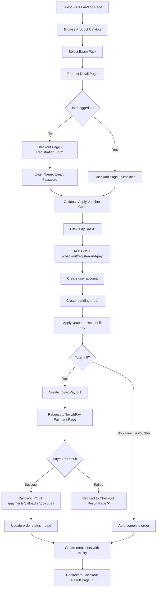

---

## 2. Returning User Login & Dashboard Flow

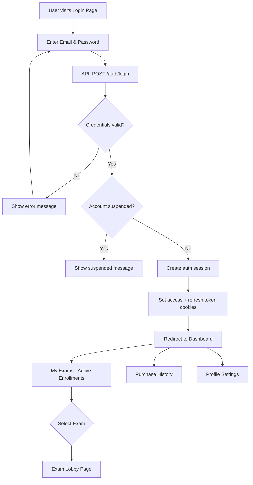

---

## 3. Exam Attempt Flow (Study Mode)

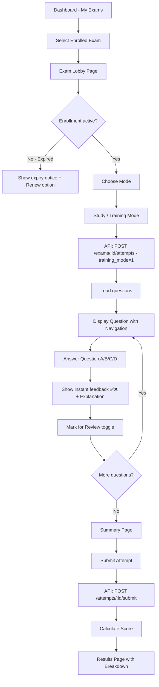

---

## 4. Exam Attempt Flow (Timed Exam Mode)

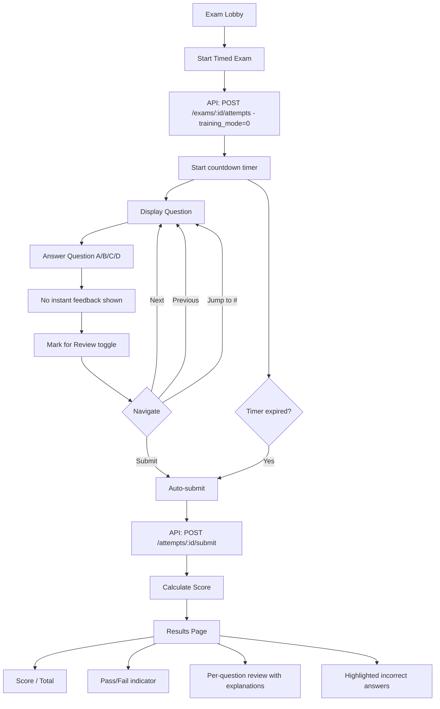

---

## 5. Admin Content Management Flow

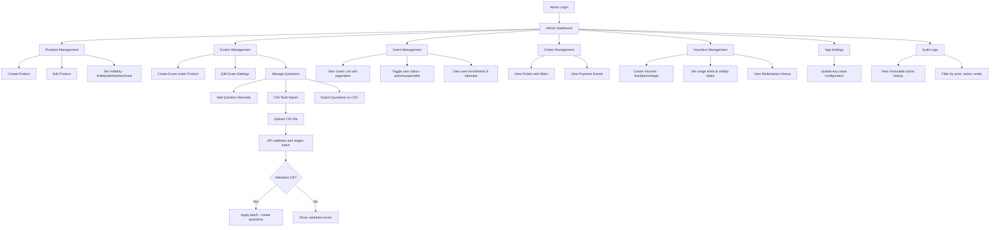

---

## 6. Password Reset Flow

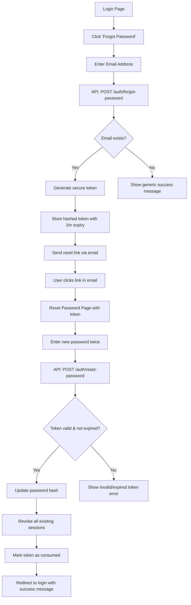

---

## 7. JWT Token Refresh Flow

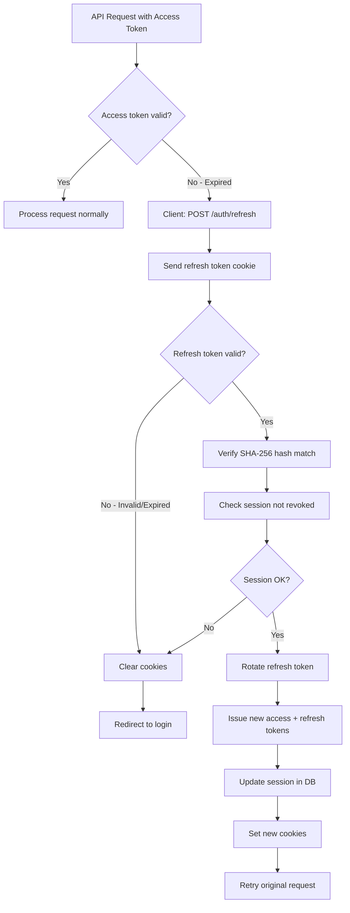

---

## 8. Checkout with Voucher Flow

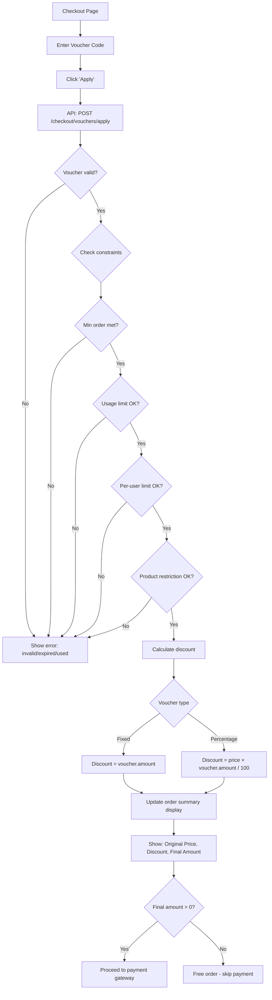

---

## 9. Payment Verification Flow (Localhost Callback Fallback)

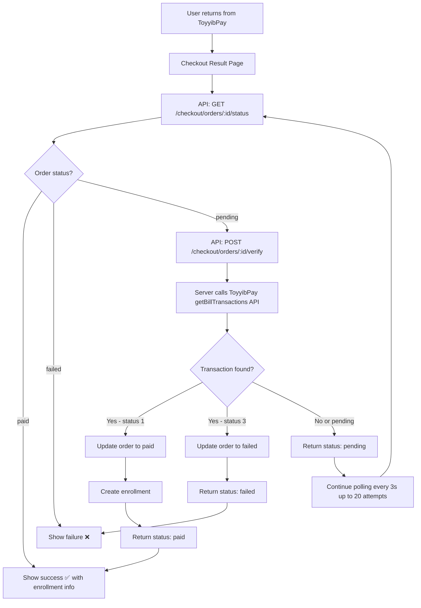

---

## 10. Exam Auto-Resume Flow

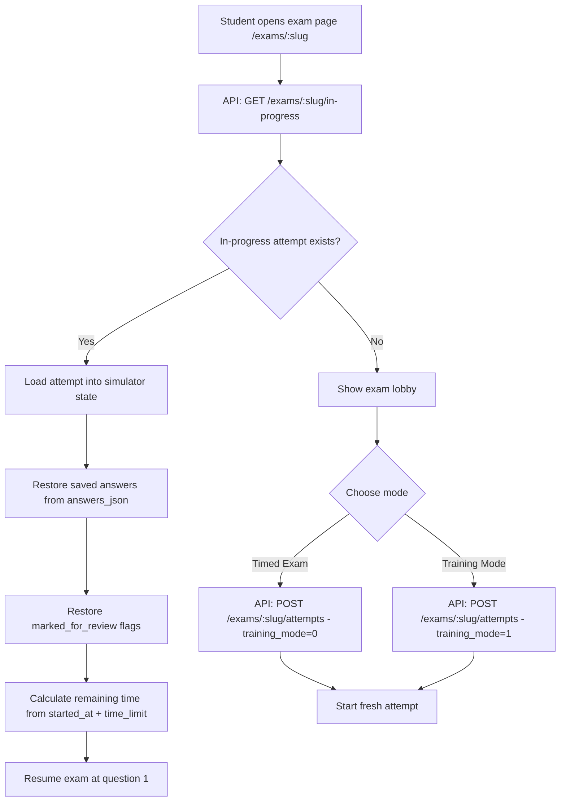

---

## 11. Landing Page Enrollment Display Flow

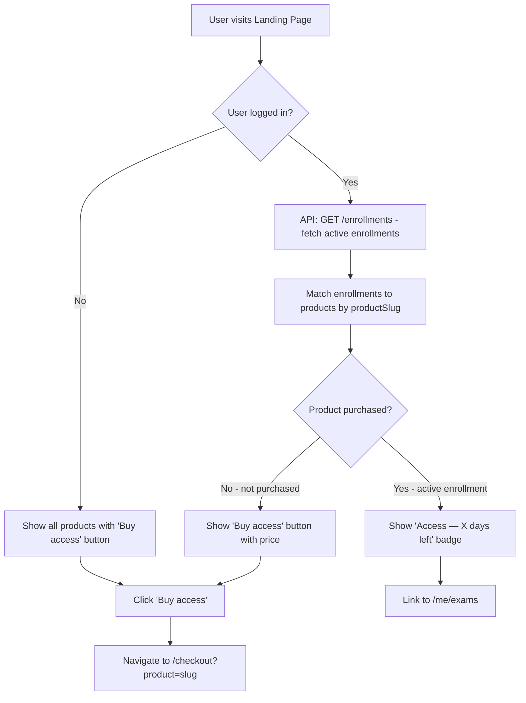
