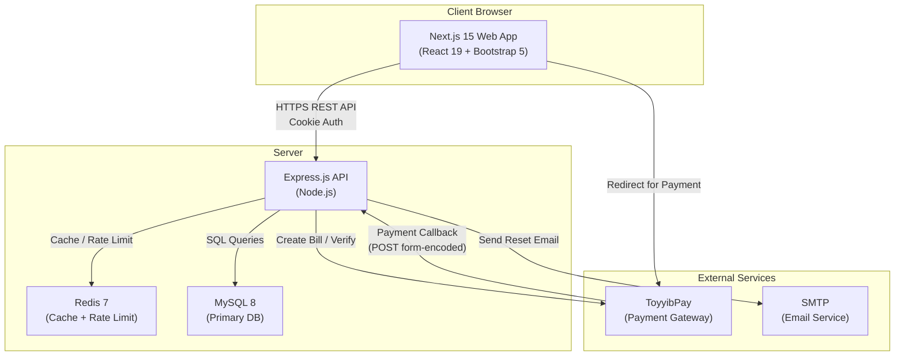
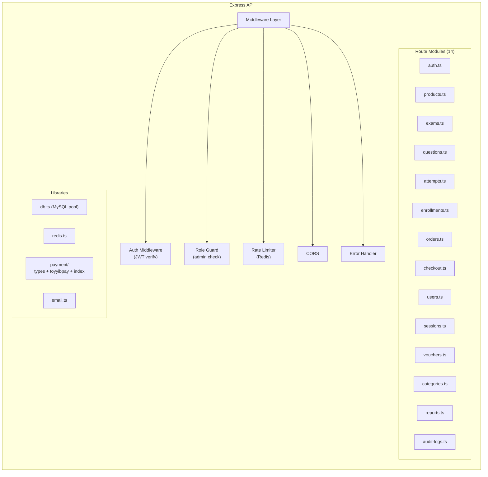
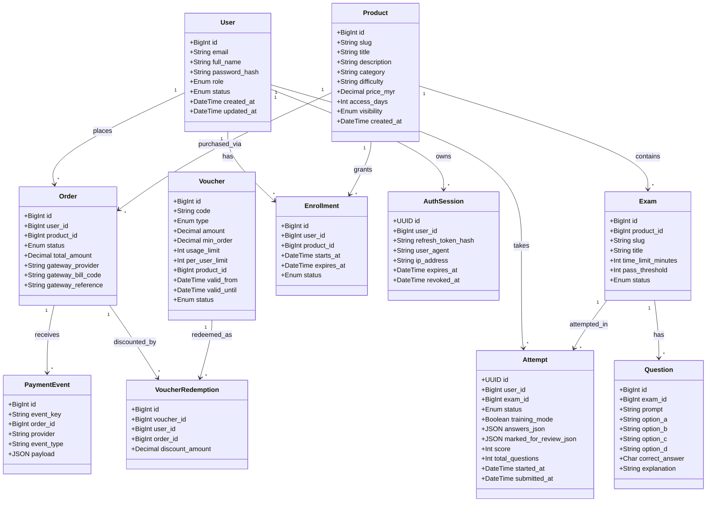
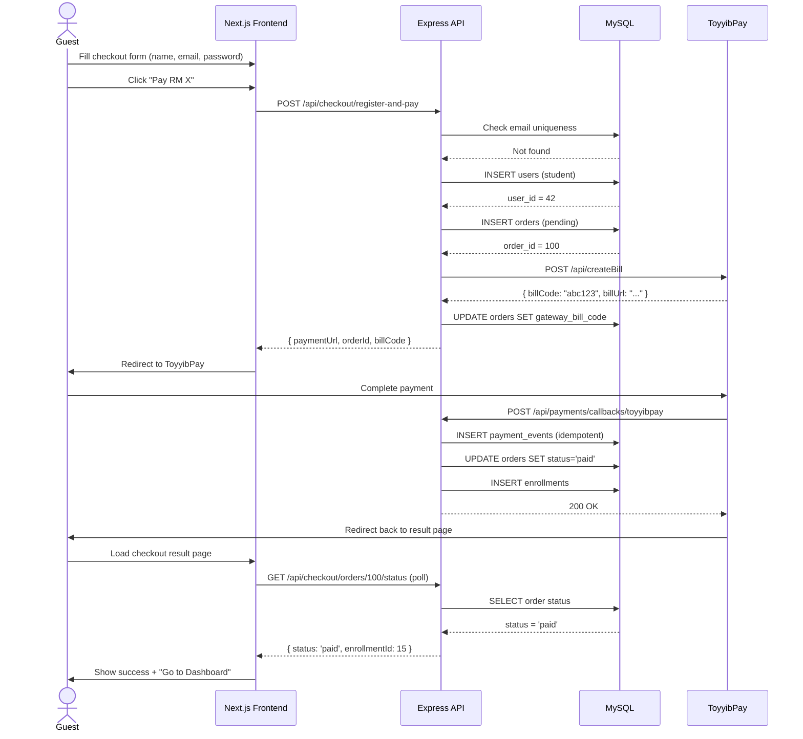
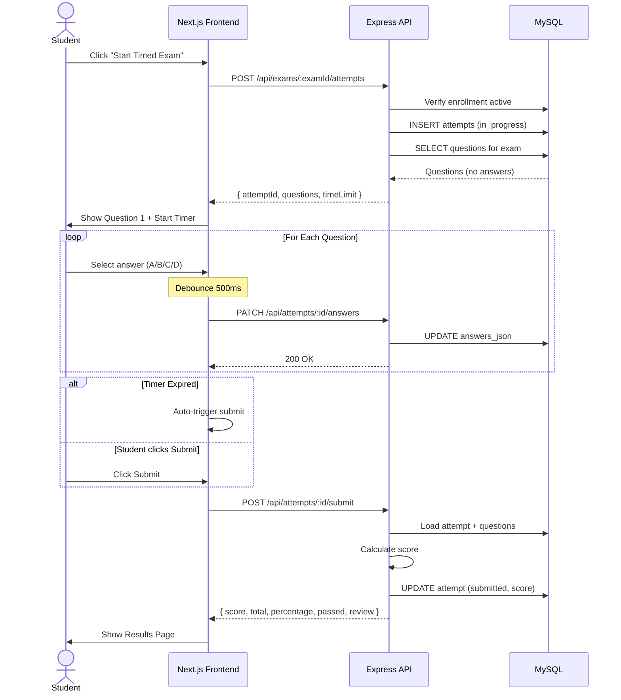
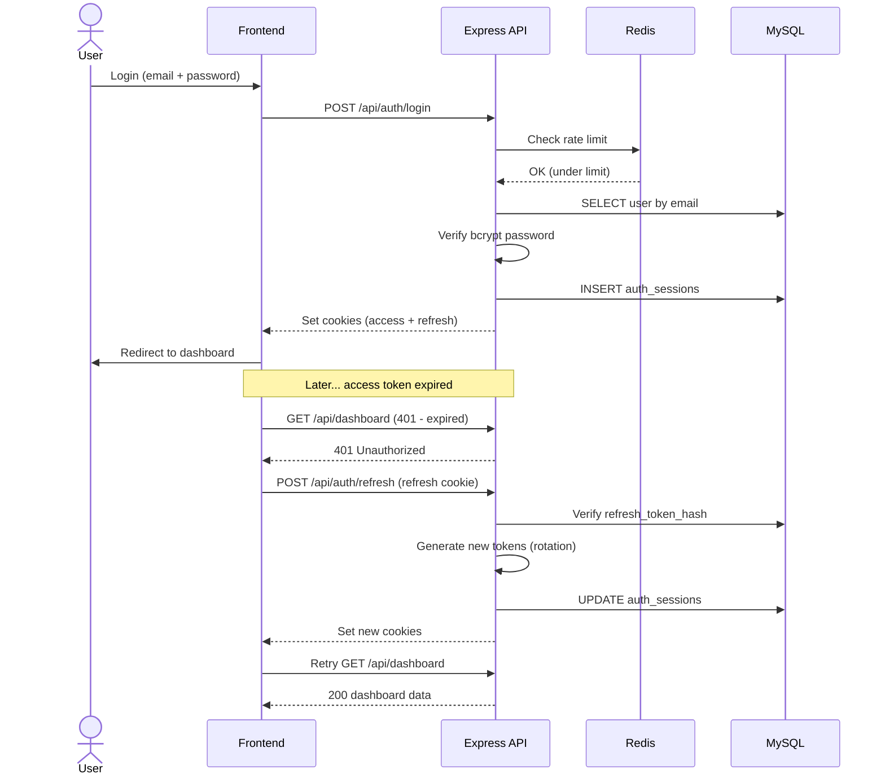
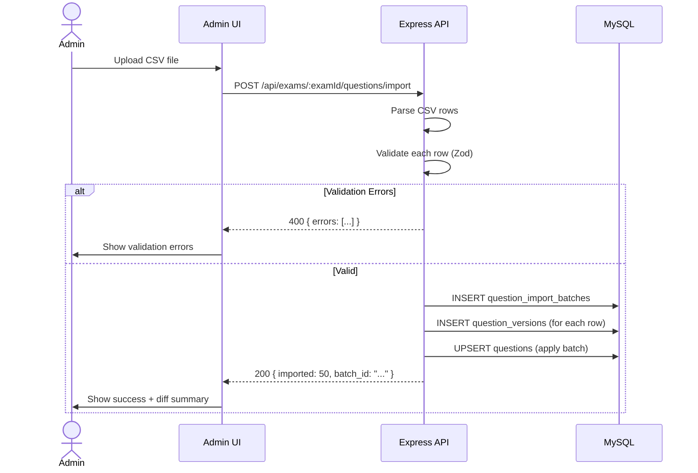
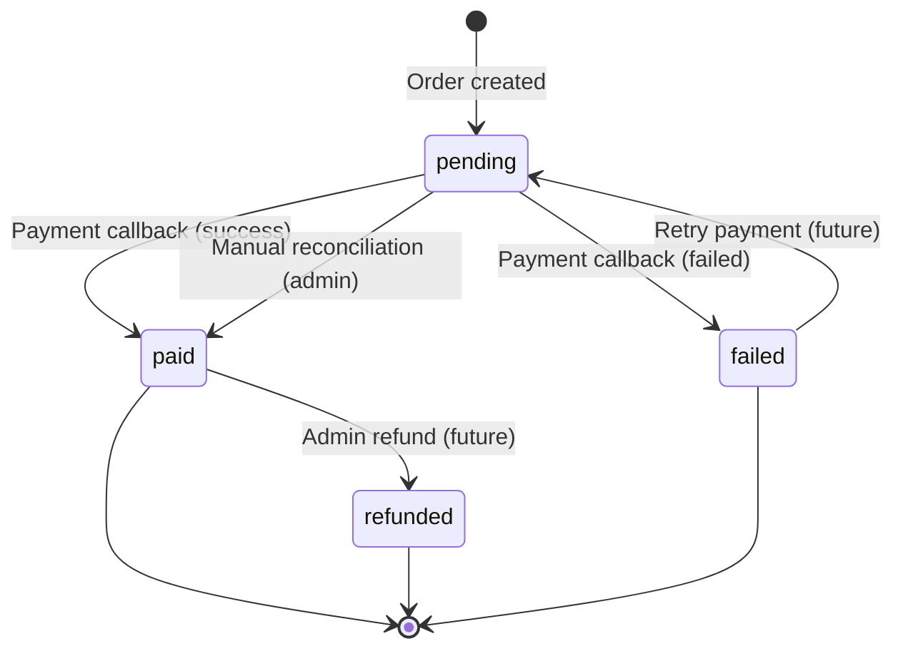
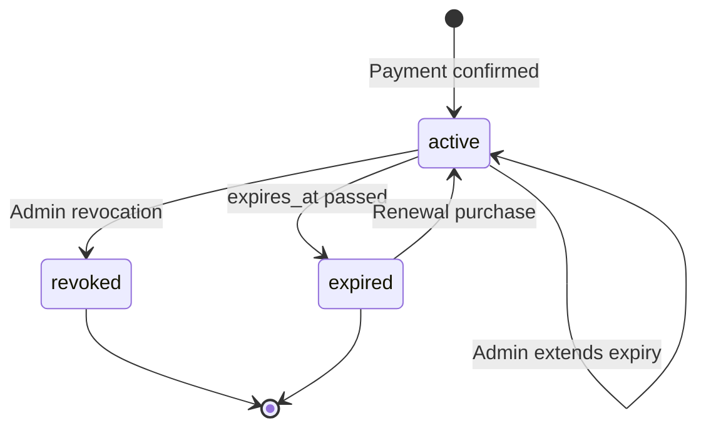
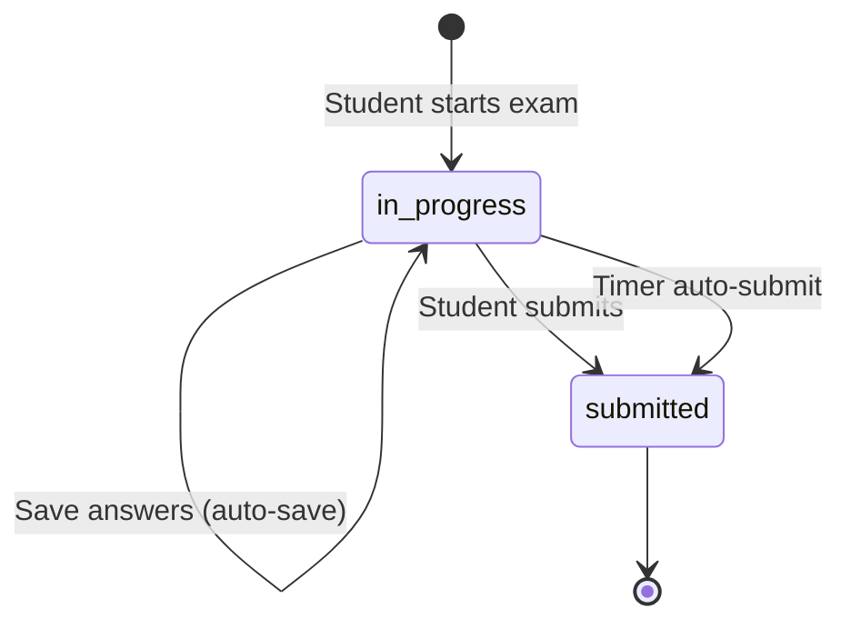

# UML Diagrams

**Project:** PM Certification Practice Exam Simulator Platform  
**Version:** 1.0  
**Date:** 17 April 2026

---

## 1. Component Diagram — System Architecture

---

## 2. Component Diagram — API Module Structure

---

## 3. Class Diagram — Domain Models

---

## 4. Sequence Diagram — Guest Purchase Flow

---

## 5. Sequence Diagram — Timed Exam Attempt

---

## 6. Sequence Diagram — JWT Auth & Token Refresh

---

## 7. Sequence Diagram — Admin CSV Question Import

---

## 8. State Diagram — Order Lifecycle

---

## 9. State Diagram — Enrollment Lifecycle

---

## 10. State Diagram — Attempt Lifecycle

