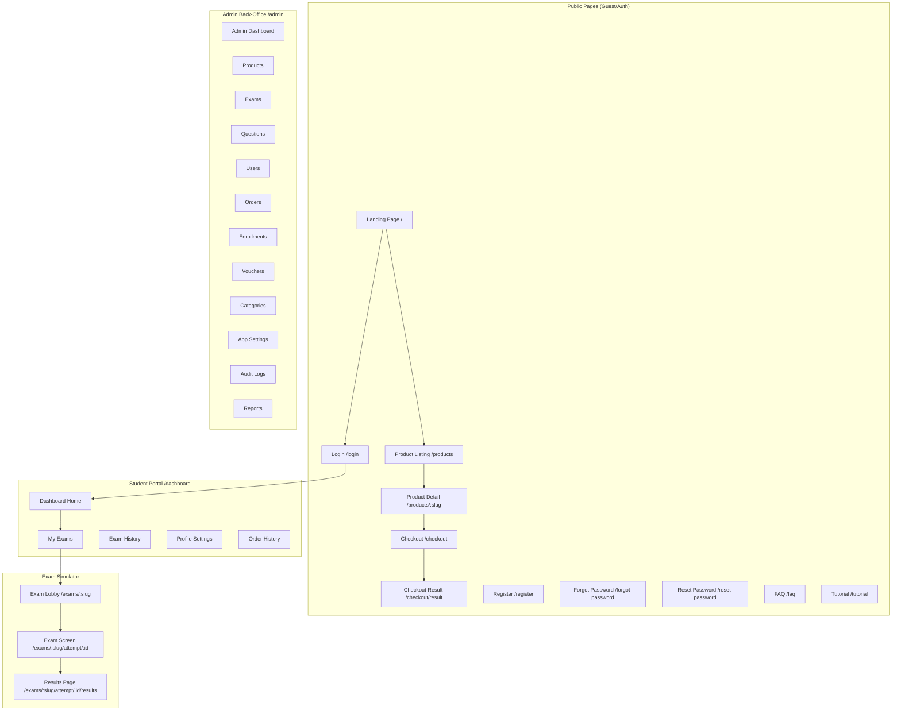

# UI Wireframes & Screen Inventory

**Project:** PM Certification Practice Exam Simulator Platform  
**Version:** 1.0  
**Date:** 17 April 2026  
**Design System:** Bootstrap 5.3.8, Primary Blue (#0d6efd)

---

## Screen Map Overview



---

## 1. Public Pages

### 1.1 Landing Page `/`

```
┌─────────────────────────────────────────────────────┐
│  [Logo] PM Practice Exam       [Sign in] / [Avatar▾]│
├─────────────────────────────────────────────────────┤
│                                                     │
│         PM Certification Practice Exams             │
│    Prepare for PMP, CAPM and related credentials    │
│    with realistic timed exam simulations.           │
│                                                     │
│              [Browse Exam Packs →]                  │
│                                                     │
├─────────────────────────────────────────────────────┤
│  ┌───────────┐  ┌───────────┐  ┌───────────┐      │
│  │ Timed     │  │ Instant   │  │ Detailed  │      │
│  │ Exams     │  │ Results   │  │ Reviews   │      │
│  │           │  │           │  │           │      │
│  └───────────┘  └───────────┘  └───────────┘      │
│                                                     │
│  Featured Exam Packs                               │
│  ┌──────────────────┐  ┌──────────────────┐        │
│  │ PMP Simulator    │  │ CAPM Practice    │        │
│  │ 180 Questions    │  │ 150 Questions    │        │
│  │ RM 49.00         │  │ RM 39.00         │        │
│  │ [View Details]   │  │ [View Details]   │        │
│  └──────────────────┘  └──────────────────┘        │
│                                                     │
├─────────────────────────────────────────────────────┤
│  Footer: © PM Advance | FAQ | Tutorial             │
└─────────────────────────────────────────────────────┘
```

**Components:**
- PublicNavbar (shared): Logo left, auth state right (Sign in button or Avatar dropdown)
- Hero section: Title, description, CTA button
- Feature highlights: 3 cards inline
- Product cards: Grid of published products
- Footer with links

---

### 1.2 Product Detail `/products/:slug`

```
┌─────────────────────────────────────────────────────┐
│  [PublicNavbar]                                      │
├─────────────────────────────────────────────────────┤
│                                                     │
│  ← Back to catalog                                  │
│                                                     │
│  PMP Practice Exam Simulator                        │
│  ─────────────────────────────                      │
│  Category: PMP │ Difficulty: Intermediate           │
│                                                     │
│  This exam pack includes 3 full-length practice     │
│  exams simulating the real PMP experience...        │
│                                                     │
│  ┌─────────────────────────────────┐               │
│  │ Price: RM 49.00                 │               │
│  │ Access: 90 days from purchase   │               │
│  │                                 │               │
│  │ Includes:                       │               │
│  │ • 3 Exams (180 questions each)  │               │
│  │ • Timed + Training modes        │               │
│  │ • Detailed explanations         │               │
│  │                                 │               │
│  │ [Buy Now → Checkout]            │               │
│  └─────────────────────────────────┘               │
│                                                     │
└─────────────────────────────────────────────────────┘
```

---

### 1.3 Checkout `/checkout?product=:slug`

```
┌─────────────────────────────────────────────────────┐
│  [PublicNavbar]                                      │
├──────────────────────────┬──────────────────────────┤
│                          │                          │
│  Checkout                │  Order Summary           │
│  ─────────               │  ─────────────           │
│                          │                          │
│  [If Guest:]             │  PMP Simulator Pack      │
│  Full Name: [________]   │  Qty: 1                  │
│  Email:     [________]   │                          │
│  Password:  [________]   │  Subtotal: RM 49.00      │
│                          │  Discount: -RM 10.00     │
│  [If Logged In:]         │  ──────────────          │
│  Purchasing as           │  Total:    RM 39.00      │
│  ○ student@example.com   │                          │
│                          │                          │
│  Voucher Code            │                          │
│  [__________] [Apply]    │                          │
│  ✅ SAVE10 applied!      │                          │
│                          │                          │
│  [Pay RM 39.00 →]       │                          │
│                          │                          │
└──────────────────────────┴──────────────────────────┘
```

**States:**
- Guest: Shows full registration form
- Logged in: Shows user info, no form fields
- Voucher applied: Shows discount in summary
- Processing: Button disabled with spinner

---

### 1.4 Checkout Result `/checkout/result`

```
┌─────────────────────────────────────────────────────┐
│  [PublicNavbar]                                      │
├─────────────────────────────────────────────────────┤
│                                                     │
│      ┌────────────────────────────────┐             │
│      │                                │             │
│      │   [Success]                    │             │
│      │   ✅ Payment Successful!       │             │
│      │                                │             │
│      │   Your access to PMP Simulator │             │
│      │   Pack is now active.          │             │
│      │                                │             │
│      │   [Go to Dashboard →]          │             │
│      │                                │             │
│      │   [Pending]                     │             │
│      │   ⏳ Processing payment...     │             │
│      │   (auto-polling every 3s)      │             │
│      │                                │             │
│      │   [Failed]                     │             │
│      │   ❌ Payment failed.           │             │
│      │   [Try Again]                  │             │
│      │                                │             │
│      └────────────────────────────────┘             │
│                                                     │
└─────────────────────────────────────────────────────┘
```

---

## 2. Student Portal

### 2.1 Dashboard Home `/dashboard`

```
┌─────────────────────────────────────────────────────┐
│  [Logo]  Dashboard  My Exams  History  Profile      │
│                                    [Avatar ▾]       │
├─────────────────────────────────────────────────────┤
│                                                     │
│  Welcome back, Ahmad!                               │
│  Last test: PMP Exam 1, scored 78%                  │
│                                                     │
│  ┌──────────┐  ┌──────────┐  ┌──────────┐         │
│  │ 3        │  │ 5        │  │ 1        │         │
│  │ Active   │  │ Completed│  │ In       │         │
│  │ Exams    │  │ Attempts │  │ Progress │         │
│  └──────────┘  └──────────┘  └──────────┘         │
│                                                     │
│  Filter: [All Certifications ▾]                     │
│                                                     │
│  Active Subscriptions                               │
│  ┌───────────────────────────────────────┐          │
│  │ PMP Simulator Pack                    │          │
│  │ Expires: 15 Jul 2026 (82 days left)   │          │
│  │ [Start Exam ▾]                        │          │
│  │   • PMP Practice Exam 1              │          │
│  │   • PMP Practice Exam 2              │          │
│  │   • PMP Practice Exam 3              │          │
│  └───────────────────────────────────────┘          │
│                                                     │
└─────────────────────────────────────────────────────┘
```

---

### 2.2 Exam Lobby `/exams/:slug`

```
┌─────────────────────────────────────────────────────┐
│  [Dashboard Navbar]                                  │
├─────────────────────────────────────────────────────┤
│                                                     │
│  ← Back to Dashboard                                │
│                                                     │
│  PMP Practice Exam 1                                │
│  ──────────────────                                 │
│                                                     │
│  📋 180 Questions                                   │
│  ⏱️ 230 minutes time limit                          │
│  📊 Pass mark: 75%                                  │
│                                                     │
│  Choose Mode:                                       │
│  ┌──────────────────┐  ┌──────────────────┐        │
│  │  Timed Exam      │  │  Study Mode      │        │
│  │                   │  │                   │        │
│  │  Realistic exam   │  │  See answers     │        │
│  │  conditions with  │  │  immediately     │        │
│  │  countdown timer  │  │  with detailed   │        │
│  │                   │  │  explanations    │        │
│  │  [Start Exam]     │  │  [Start Study]   │        │
│  └──────────────────┘  └──────────────────┘        │
│                                                     │
│  In-Progress Attempts:                              │
│  • Started 2h ago - Q42/180 answered [Resume →]     │
│                                                     │
└─────────────────────────────────────────────────────┘
```

---

### 2.3 Exam Screen `/exams/:slug/attempt/:id`

```
┌─────────────────────────────────────────────────────┐
│  PMP Exam 1    Q 42 of 180    ⏱️ 03:22:15    [Save]│
├──────────────────────────────────┬──────────────────┤
│                                  │                  │
│  Question 42                     │  Question Grid   │
│  ──────────                      │  ────────────    │
│  A project manager is working    │  [1][2][3][4]    │
│  on a complex IT project and     │  [5][6][7][8]    │
│  discovers that a key            │  ...             │
│  stakeholder has not been        │  [41][42][43]    │
│  consulted. What should the      │  ...             │
│  project manager do FIRST?       │  [179][180]      │
│                                  │                  │
│  ○ A) Escalate to the sponsor   │  ■ Answered      │
│  ○ B) Update the stakeholder    │  □ Unanswered    │
│       register                   │  ■ Flagged       │
│  ● C) Schedule a meeting with   │  ■ Current       │
│       the stakeholder            │                  │
│  ○ D) Continue with the         │  [Show flagged    │
│       current plan               │   only ☐]        │
│                                  │                  │
│  [🚩 Flag for Review]           │                  │
│                                  │                  │
│  [← Previous]    [Next →]       │                  │
│                                  │                  │
│                 [Review & Submit]│                  │
│                                  │                  │
└──────────────────────────────────┴──────────────────┘
```

**Interactive Elements:**
- Radio buttons for answer selection (A/B/C/D)
- Flag toggle button (yellow highlight when flagged)
- Strikethrough: click option text to toggle line-through
- Question grid: click number to jump
- Timer: red + pulse when < 5 min

---

### 2.4 Pre-Submit Review

```
┌─────────────────────────────────────────────────────┐
│  PMP Exam 1    Review Your Answers    ⏱️ 00:12:33  │
├─────────────────────────────────────────────────────┤
│                                                     │
│  Summary                                            │
│  ──────                                             │
│  ✅ Answered:   162 / 180                            │
│  ⬜ Unanswered:  18                                  │
│  🚩 Flagged:     7                                   │
│                                                     │
│  ┌─────┬────────────┬────────┬─────────┐           │
│  │ #   │ Status     │ Answer │ Flagged │           │
│  ├─────┼────────────┼────────┼─────────┤           │
│  │ 1   │ ✅ Answered│ C      │         │           │
│  │ 2   │ ✅ Answered│ A      │ 🚩      │           │
│  │ 3   │ ⬜ Skipped │ —      │         │           │
│  │ ... │            │        │         │           │
│  └─────┴────────────┴────────┴─────────┘           │
│                                                     │
│  Click any row to go back to that question.         │
│                                                     │
│  [← Back to Exam]        [Submit Exam ✓]           │
│                                                     │
└─────────────────────────────────────────────────────┘
```

---

### 2.5 Results Page

```
┌─────────────────────────────────────────────────────┐
│  [Dashboard Navbar]                                  │
├─────────────────────────────────────────────────────┤
│                                                     │
│  PMP Practice Exam 1 — Results                      │
│  ─────────────────────────────                      │
│                                                     │
│  ┌──────────────────────────────────┐               │
│  │       PASSED ✅                   │               │
│  │                                   │               │
│  │   Score: 142 / 180 (78.9%)       │               │
│  │   Pass Mark: 75%                  │               │
│  │   Time Used: 3h 17min / 3h 50min │               │
│  └──────────────────────────────────┘               │
│                                                     │
│  Per-Question Review                                │
│  ──────────────────                                 │
│  Q1 ✅ Your answer: C (Correct)                     │
│  Q2 ❌ Your answer: A │ Correct: B                  │
│     💡 Explanation: The stakeholder register...     │
│  Q3 ⬜ Not answered │ Correct: D                    │
│     💡 Explanation: According to PMBOK...           │
│  ...                                                │
│                                                     │
│  [← Back to Dashboard]  [Retake Exam]              │
│                                                     │
└─────────────────────────────────────────────────────┘
```

---

## 3. Admin Back-Office

### 3.1 Admin Dashboard `/admin`

```
┌─────────────────────────────────────────────────────┐
│  PM Admin    [Admin Name ▾]                         │
├───────────┬─────────────────────────────────────────┤
│           │                                         │
│  Dashboard│  Overview                               │
│  Products │  ──────────                             │
│  Exams    │  ┌────────┐┌────────┐┌────────┐┌──────┐│
│  Users    │  │RM 4,200││ 45     ││ 8      ││ 3    ││
│  Orders   │  │Revenue ││Active  ││Expiring││Failed││
│  Enroll.  │  │(month) ││Subs    ││Soon    ││Pays  ││
│  Vouchers │  └────────┘└────────┘└────────┘└──────┘│
│  Category │                                         │
│  Reports  │  Recent Orders                          │
│  Settings │  ┌───────────────────────────────┐      │
│  Audit Log│  │ #100 │ Ahmad │ PMP │ RM49 │ paid   ││
│           │  │ #99  │ Siti  │ CAPM│ RM39 │ pending││
│           │  │ #98  │ Ali   │ PMP │ RM49 │ paid   ││
│           │  └───────────────────────────────┘      │
│           │                                         │
│           │  Quick Actions                          │
│           │  [+ New Product] [+ New Voucher]        │
│           │                                         │
└───────────┴─────────────────────────────────────────┘
```

**Layout:** Sidebar navigation (tabs with URL persistence) + main content area

---

### 3.2 Admin Products List

```
┌───────────┬─────────────────────────────────────────┐
│  Sidebar  │  Products                               │
│           │  ─────────                              │
│           │  [+ Create Product]                     │
│           │  Search: [____________]                  │
│           │  Filter: [All ▾]                        │
│           │                                         │
│           │  ┌─────────────────────────────────┐    │
│           │  │ Title        │ Price │ Status   │    │
│           │  ├──────────────┼───────┼──────────┤    │
│           │  │ PMP Simulator│ RM 49 │ ● Published│  │
│           │  │ CAPM Pack    │ RM 39 │ ● Published│  │
│           │  │ New Pack     │ RM 29 │ ○ Draft    │  │
│           │  └──────────────┴───────┴──────────┘    │
│           │                                         │
│           │  [← 1 2 3 →]                           │
└───────────┴─────────────────────────────────────────┘
```

---

### 3.3 Admin Question Import

```
┌───────────┬─────────────────────────────────────────┐
│  Sidebar  │  Import Questions — PMP Exam 1          │
│           │  ─────────────────────────               │
│           │                                         │
│           │  Upload CSV:                            │
│           │  ┌─────────────────────────┐            │
│           │  │  📄 Drop CSV here       │            │
│           │  │  or [Browse Files]       │            │
│           │  └─────────────────────────┘            │
│           │                                         │
│           │  Preview (50 questions parsed):         │
│           │  ┌──────────────────────────────┐       │
│           │  │ # │ Prompt         │ Answer │       │
│           │  │ 1 │ A project m... │ B      │       │
│           │  │ 2 │ When using ... │ C      │       │
│           │  │ 3 │ ⚠️ CHANGED    │ A→D    │       │
│           │  └──────────────────────────────┘       │
│           │                                         │
│           │  + 48 new │ ~ 2 modified │ - 0 removed │
│           │                                         │
│           │  [Cancel]              [Apply Import]   │
│           │                                         │
└───────────┴─────────────────────────────────────────┘
```

---

## 4. Responsive Breakpoints

| Breakpoint | Width | Layout |
|-----------|-------|--------|
| Desktop | ≥1200px | Full sidebar + content |
| Tablet | 768–1199px | Collapsible sidebar, stacked cards |
| Mobile | <768px | Hamburger menu, single column, compact exam grid |

---

## 5. Design Tokens

| Token | Value | Usage |
|-------|-------|-------|
| Primary | #0d6efd | Buttons, links, active states |
| Success | #198754 | Correct answers, pass indicators |
| Danger | #dc3545 | Incorrect, errors, timer warning |
| Warning | #ffc107 | Flagged questions, pending states |
| Info | #0dcaf0 | Current question highlight |
| Background | #f8f9fa | Page background |
| Card BG | #ffffff | Card surfaces |
| Text Primary | #212529 | Body text |
| Text Muted | #6c757d | Secondary text |
| Border | #dee2e6 | Card borders, dividers |
| Font | System stack | -apple-system, "Segoe UI", Roboto, "Helvetica Neue", sans-serif |
